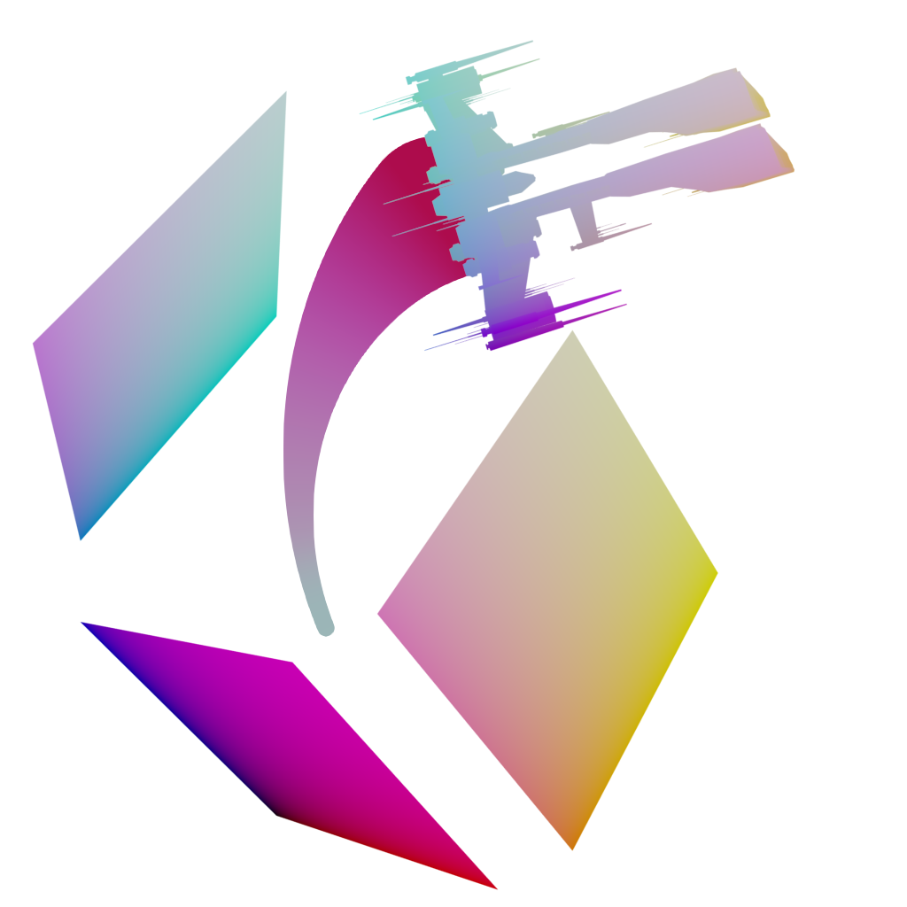

# Quad Exporter

The goal of this program is to provide an alternative to the program `Tri-Exporter`, which hasn't been updated in a very, very long time.

## Contributors

**Hoed Cosmere:** Owner of the Quad-Exporter repository.

**Potato/Mewlaki:** Hoed's cat, Maine Coon mascot, and giver of softness.

 

## Support

- Send isk to `Hoed Cosmere` in game (with the reason being `quad-exporter`) to get your name added here as thanks!
- Contribute to the repository to get your name added here as thanks!
- I'll also add your name to the loading splash screen if you do either of the above in significant quantity or quality!

## Usage

Install the dependencies in `App/requirements.txt`. Make sure that you have `tkinter`. If you install python with the binaries from `python.org` you will have them. If not you can install them with `pip`, `brew`, or whatever you use.

In `App/pref/` there are 2 files (I'll probably add more), these are your preferences.

`enabled.txt` includes all your enabled file extensions. Only files with these extensions will be displayed. I've added as many as I've noticed, but I've commented them out with `#`. If there are no extensions in this file, or they are all commented out, then all files will be displayed.

`savedPaths.txt` includes all of the saved paths that this program needs. It is in the `.gitignore` because it is unique to every individual. When you first launch this program you will be asked to configure your paths.

The path you select to your `resfileindex.txt` determines what you can see. You can point it to the normal `resfileindex.txt` to see most of the items, or the specific `index_sisi.txt` or `index_tq.txt` to see those, or even your own custom file.

When setting the path to your `ResFiles` folder, make sure that you select the folder that includes all the small subset folders inside it! Not the parent directory and not the Eve app! This means that if you're on macOS, you will likely have to create a [symbolic link](https://www.howtogeek.com/297721/how-to-create-and-use-symbolic-links-aka-symlinks-on-a-mac/) to this folder, as it's packaged inside the app and this python code cannot access that without elevated privileges (which I do not want to do, to avoid possible security vulnerabilities).

## Special Thanks to

- [CCP](https://www.eveonline.com) for Eve Online!
- [Lucide](https://github.com/lucide-icons/lucide) for the icon pack!
- [Pillow](https://pillow.readthedocs.io/en/stable/) for their image library!
- [CairoSVG](https://cairosvg.org) for their SVG Library!
- [Tamber's GR2 Conversion Tool](https://github.com/cppctamber/evegr2toobj) for making that easier for me!
- Your support!
  - Send isk to `Hoed Cosmere` in game (with the reason being `quad-exporter`) to get your name added here as thanks!
  - Contribute to the repository to get your name added here as thanks!
  - I'll also add your name to the loading splash screen if you do either of the above in significant quantity or quality!
